## 일정관리프로그램
1. 기본 화면
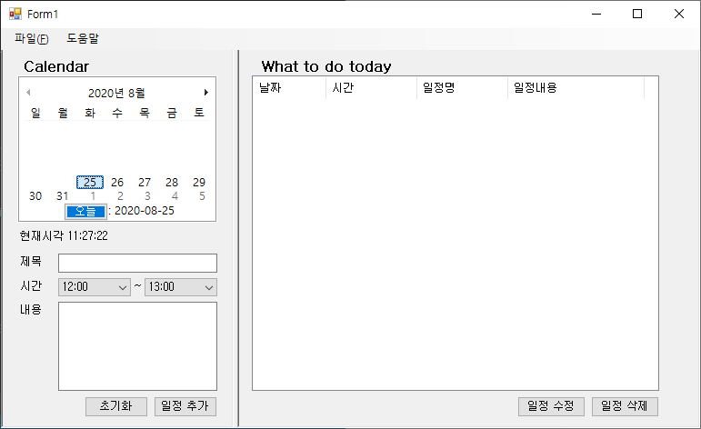

 - 날짜는 오늘 이후의 날짜만 표시
 - 시작시간의 **default값**은 현재 시간으로부터 가장 가까운 정시를 표시
 - 종료시간의 **default값**은 시작시간 + 1시간
 - 시작시간은 00:00~23:00까지 표기
 - 종료시간은 시작시간~23:00까지 표기
 - "오늘" 버튼 클릭 시 오늘 날짜로 캘린더 이동

   
   
2. 일정 추가
   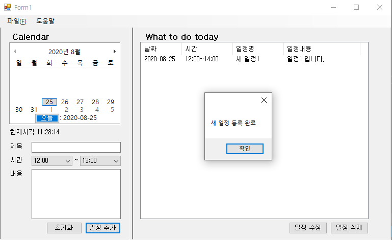

3. 일정 수정
   * ListView에서 일정을 하나 선택하고 일정 수정 버튼 클릭 시 해당 일정의 정보가 담겨진 새로운 창(form)이 뜨고 수정할 수 있음
     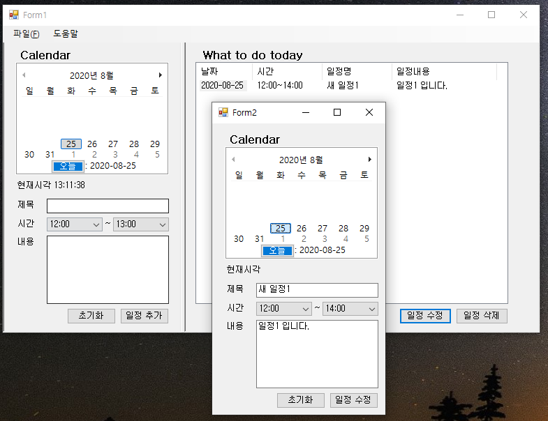

* 수정된 내용은 일정 수정 버튼을 통해 저장할 수 있음
     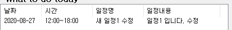
   
   * ListView에서 여러 일정을 선택하고 일정 수정 시 오류 출력
     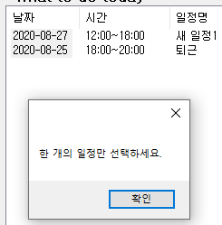
     
     
   
4. 일정 삭제
   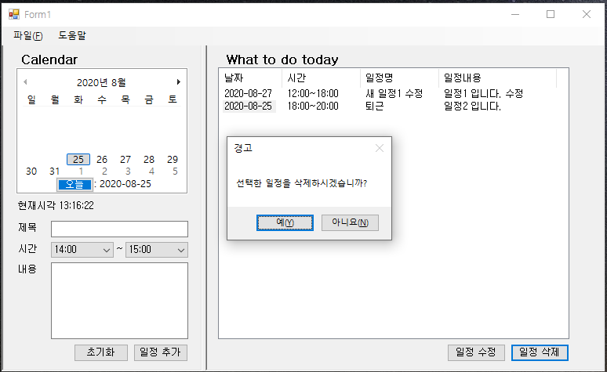

   * 일정을 선택하고 일정 삭제 클릭 시 경고창을 띄운 뒤 예를 누르면 삭제, 아니요를 누르면 삭제를 취소한다.
     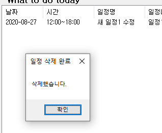

5. 파일관련 기능
   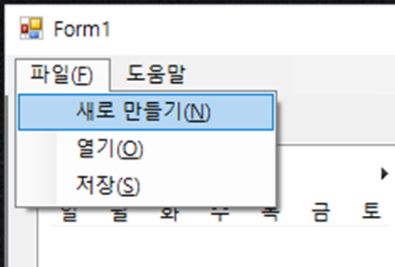

   1. 새로 만들기(N)
      * 새로 만들기 시 이미 작성된 내용이 있으면 경고창 출력
        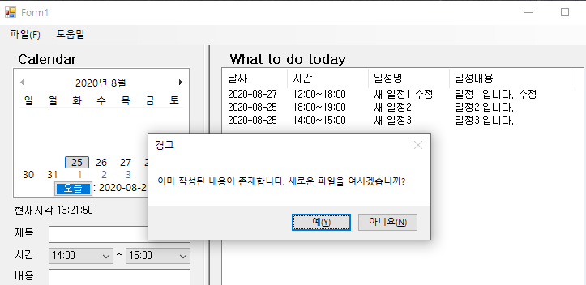

   2. 열기(O)
      * 저장되어있는 일정관리표를 읽음
        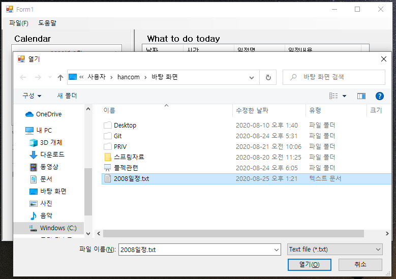
      * 이미 작성된 내용이 있고 파일열기를 시도하면 경고창을 출력
        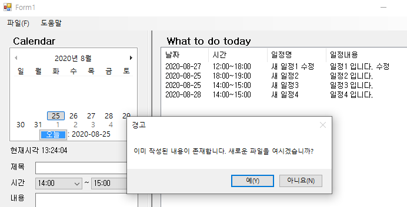
   3. 저장(S)
      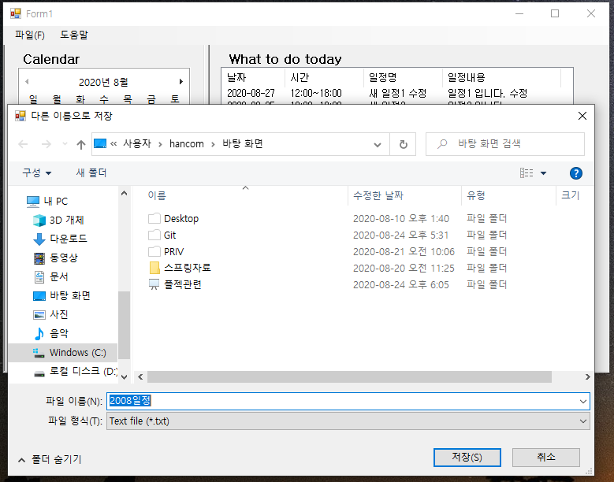
      * 현재의 일정관리표를 저장
      * .txt파일로 관리하며 안에는 Separator로 %를 사용
